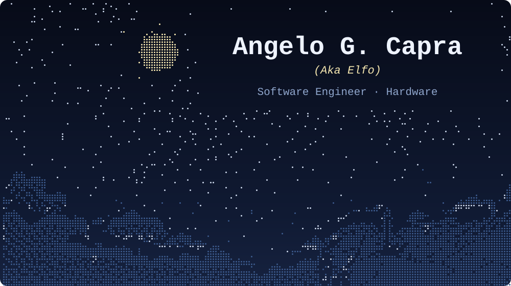
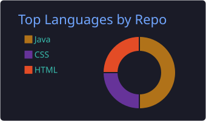
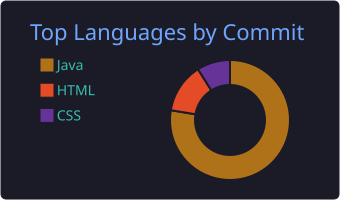
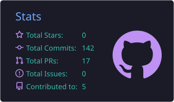

  

   

  
  
  

## Sobre mim

Desenvolvedor, trabalho principalmente com back-end em **Java e Spring Boot**, curto e me interesso por hardware e redes. No meu tempo livre, estou mexendo com **hardware, homelab e self-hosting**.

## Tecnologias

  

## Projetos pessoais

### 🏠 Home-Maiden &nbsp; 

Sistema de gestão pessoal **self-hosted** para centralizar contas mensais, gastos e, em breve, conhecimento pessoal, wishlist e leituras.

- **Back-end:** Java 21, Spring Boot 4, Spring Data JDBC, Flyway e PostgreSQL
- **Front-end:** Next.js, TypeScript, Tailwind e shadcn/ui · **App Android:** Kotlin e Jetpack Compose
- **Segurança:** Argon2id, 2FA (TOTP), JWT com refresh rotativo e códigos de recuperação
- **Captura automática de gastos:** o celular repassa as notificações dos apps de banco e o servidor classifica o que é compra
- **Infra:** Docker Compose, CI com deploy por tag, Coolify e túnel Cloudflare — decisões registradas em ADRs

| Outros projetos | Descrição | Stack |
|---|---|---|
| [PC-Build](https://github.com/AngeloGCapra/PC-Build) | Plataforma para montagem e recomendação de hardware | Java |
| [Sistema-Biblioteca](https://github.com/AngeloGCapra/Sistema-Biblioteca) | Sistema de gerenciamento de biblioteca | Java, JSF/PrimeFaces |

## Estatísticas

  
  
  
   
  

<picture>
  <source media="(prefers-color-scheme: dark)" srcset="https://raw.githubusercontent.com/AngeloGCapra/AngeloGCapra/output/github-snake-dark.svg"/>
  
</picture>
